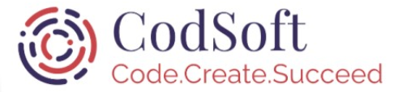

## FreeLancing, Self-Employed
- *Data Scientist* | Feb'24 - Present
- 
- Tags: FreeLance
- Badges:
  - Badge [blue]
- List Items:
  - School Management System (Python, Sqlite, Tkinter) 
     Developed a desktop app to manage student data and automate sms notifications upon fee submissions. 
     Enhanced administrative efficiency by digitizing manual processes. 
  - Cricket Club Mobile App (Python,Kivy, Kivymd, Sqlite) 
     Created an android app for managing player records, expenses, and fee tracking with an interactive dashboard. 
     Improved transparency and ease of financial reporting. 

## CodSoft Internship
- *Machine Learning Engineer* | july'23 - aug'23
- 
- Tags: CodSoft
- Badges:
  - Badge [blue]
- List Items:
  - Car Sales Prediction
  - Credit Card Fraud Detection