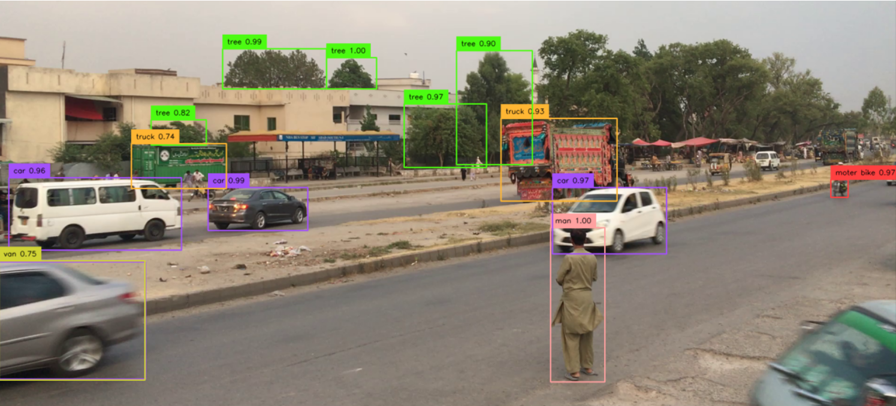
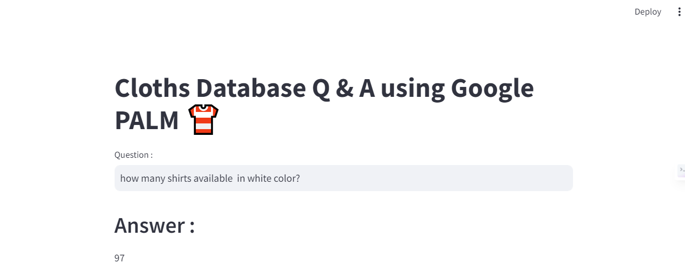
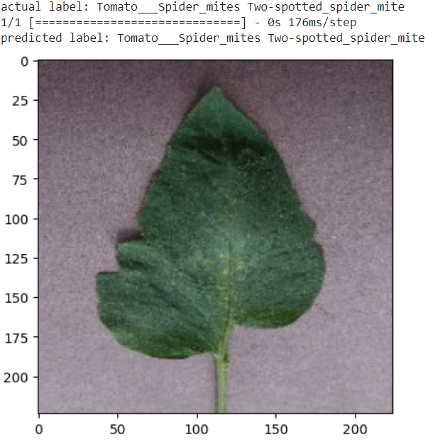

## YOLOv8 trained on custom data was used to detect object passing on a busy road. Autodistill was used for annotation.Bytetrack and supervision were used for object tracking.
Description
- 
- Tags: OpenCV, YOLO
- Badges:
  - Object Detection[blue]
- Buttons:
  - Check out the code Link [https://github.com/Basit341/yolo-busy-road-object-detection.git]

## A Streamlit application which uses Langchain-google-palm embeddings to answer questions from your database without querying.
Description
- 
- Tags: NLP
- Badges:
  - LLM [blue]
- Buttons:
  - Check out the code Link [https://github.com/Basit341/Langchain-google-palm-fine-tuning-database-Q-A.git]

## Tomotto diesease detection, trained with deeplearning with 10 classes of tomotto dieseases.
Description
- 
- Tags: OpenCV
- Badges:
  - Prediction [blue]
- Buttons:
  - Check out the code Link [https://github.com/Basit341/Tomotto-Diesease-Detection--multi-class-prediction.git]