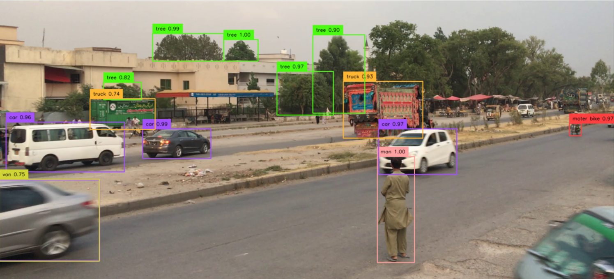

## Object Detection Using Yolo v8
- Built a real-time traffic monitoring system to detect vehicles and busy roads. 
- Autodistill was used for annotation.Bytetrack and supervision were used for object tracking. 
- Enhanced safety and efficiency through visual analytics.
- 
- Tags: OpenCV, YOLO
- Badges:
  - Object Detection[blue]
- Buttons:
  - Check out the code Link [https://github.com/Basit341/yolo-busy-road-object-detection.git]

## Chat Database
- A Streamlit application which uses Langchain-google-palm embeddings to answer questions from your database without querying.
- 
- Tags: NLP
- Badges:
  - LLM [blue]
- Buttons:
  - Check out the code Link [https://github.com/Basit341/Langchain-google-palm-fine-tuning-database-Q-A.git]

## Tomotto Disease Detection
- Implemented a multi-class classifier to detect tomato plant diseases from images. 
- Can reduce crop loss by early disease detection using web app..
- 
- Tags: OpenCV
- Badges:
  - Prediction [blue]
- Buttons:
  - Check out the code Link [https://github.com/Basit341/Tomotto-Diesease-Detection--multi-class-prediction.git]